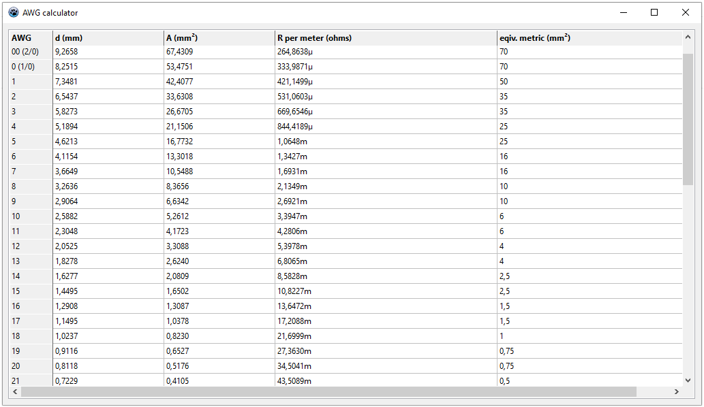

# AWG-calc
This program deals with the very strange **American Wire Gauge** (AWG) cable system, which doesnt translate to any useful European or International cable system.

# How does AWG-calc look like

Here's an example, how this software typically looks like.

This program just lists resistance per meter, eqivalent European cable diameters and diameters in milli meters.

To compile this prog, pls use the **Lazarus IDE**.
You should be able to use the prog on Win and Linux.
 
